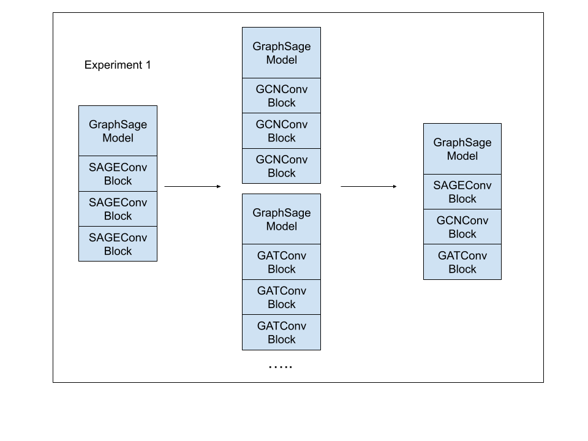

# LenskAI

"Lenski-esque AI competition trials with validated assertion databases"

## Local
    ## Setup and install
    Everything should be in the geneGRAGNN folder.

        pip install -r requirements.txt

    ## Run

        cd models
        CUDA_VISIBLE_DEVICES=0 python train_gnn_model_hackathon.py 

## DNANexus

    - Login to project
    - Click Project name
    - At top of screen click Tools->Jupyter lab
    - + new Jupyter Lab
        - Select project
        - Instance Type mem3_ssd1_gpu_x64
        - Duration 2 hours
    - Wait for initializing to complete
    - Go into the with "Open"
    - Other -> terminal

Then once you are there from terminal issue the following commands:

    git clone https://github.com/collaborativebioinformatics/LenskAI.git
    cd LenskAI/geneDRAGNN
    dx download data.tar.gz
    tar -xzvf data.tar.gz 
    cd models
    ENVNAME=ENVgene && python -m venv $ENVNAME && source $ENVNAME/bin/activate
    pip install --upgrade pip
    pip install numpy pandas tqdm torch pytorch_lightning torch_geometric wandb scikit-learn
    python train_gnn_model_hackathon.py "testName"

# Aim

The aim of the project is to examine a Lenski-Esque experiment of evolving a graph neural network aritechture.  

**Introduction:**

Genomic medicine seeks to uncover molecular mechanisms responsible for human diseases. Large biological networks provide crucial information on complex relationships and interactions between biomolecules (e.g, genes or proteins) that underlie human diseases (https://doi.org/10.1038/nrg2918 ; https://doi.org/10.1093/bioadv/vbae099). Historically, and even today, identification of genes involved in disease is expensive and time-consuming, often requiring extensive mouse and clinical studies. Network-based computational methods provide a way to model these complex relationships to identify new genetic associations. Based on the GNN models used in geneDRAGGN [5] to evaluate gene-disease associations from gene-gene interaction networks, In this study, we evolved the original graph neural networks. In a Lenski-esque manner. Specifically, we started with the original architectures as the neural network “genotypes” and then “evolved” them by flipping individual components of one network to be components of the other networks. A long-term goal would be to select the changes that had the highest benefit in terms of accuracy scores and let those networks “survive” to the next iteration of training to then only continue “evolving” the best networks. In this hackathon, we only took the initial step of training a suite of networks of two types. The first was original architectures but replaced the convolutional blocks with the blocks of the other networks. The second was building a network where rather than each layer having a single type of convolutional block, each network layer was composed of a set of blocks of each type which were then averaged as the decision from that block. 

We ran the following experiments for evolving our GNN models:

Additionally, the original geneDRAGNN paper focused on a single lung cancer dataset.  We will be using an additional brain cancer dataset from DisGenet to broaden the value of the experimental trials. This workflow can be applied to other cancer datasets available on the National Cancer Institute's Genomic Data Commons. 

# Contributors
Rorry Brenner, Peng Qiu, Nanami Kubota, Anshika Gupta, Alicja Gluszko, and Jędrzej Kubica
- 

# Methods and implementation

**Input Data files:** 

Extracting disease–gene associations from DisGeNET: https://github.com/dhimmel/disgenet

run `disgenet/disgenet.ipynb` to get all_gene_disease_associations.txt => All Gene Disease associations in DisGeNET

Protein-gene databases: Human Protein Atlas data

Protein-protein interaction databases: STRING data to get protein provide the edge list and edge list features.

Genomic-disease data: Genomic Data Commons data for brain cancer data to provide mutation features. 

Step 1: Preprocessing data 

We used the data and preprocessing pipeline as outlined in geneGRAGNN:
Data: (https://github.com/geneDRAGNN/geneDRAGNN/blob/main/data/Readme.md)
Preprocessing pipeline: (https://github.com/geneDRAGNN/geneDRAGNN/blob/main/data_preprocessing/README.md)

In short, the following scripts were used for preprocessing the data:
import_dgn.py - Imports the Disease Gene Network data and processes it to provide gene disease association scores and evidence index scores.
import_gdc.py - Imports the National Institute of Health: Genomic Data Commons data for a specific disease and processes it to provide mutation features.
import_hpa.py - Imports the Human Protein Atlas data and processes it to provide features based on genetic and RNA expression data. 
import_string.py - Imports the STRING data for protein-protein interaction and processes it to provide the edge list and edge list features. 
create_node2vec_embeddings.py - Applies an optimized node2vec to the target edgelist to create embeddings

Step 2: Generate final input data

main_data_pipeline.ipynb
Conducts the full data processing from start to finish by importing the features, edges and labels separately and providing the necessary operations to make the final datasets.

**PyTorch Geometric** GNN architectures to select from: https://pytorch-geometric.readthedocs.io/en/latest/modules/nn.html

## Workflow

# Results

# Discussion

# References

1. Lenski RE. Twice as natural. Nature [Internet]. 2001 Nov 15;414(6861):255. Available from: http://dx.doi.org/10.1038/35104715
2. Mastropietro A, De Carlo G, Anagnostopoulos A. XGDAG: explainable gene-disease associations via graph neural networks. Bioinformatics [Internet]. 2023 Aug 1;39(8). Available from: http://dx.doi.org/10.1093/bioinformatics/btad482
3. Yan R, Islam MT, Xing L. Deep representation learning of protein-protein interaction networks for enhanced pattern discovery. Sci Adv [Internet]. 2024 Dec 20;10(51). Available from: http://dx.doi.org/10.1126/sciadv.adq4324
4. Stear BJ, Mohseni Ahooyi T, Simmons JA, Kollar C, Hartman L, Beigel K, et al. Petagraph: A large-scale unifying knowledge graph framework for integrating biomolecular and biomedical data. Sci Data [Internet]. 2024 Dec 18;11(1):1338. Available from: http://dx.doi.org/10.1038/s41597-024-04070-w
